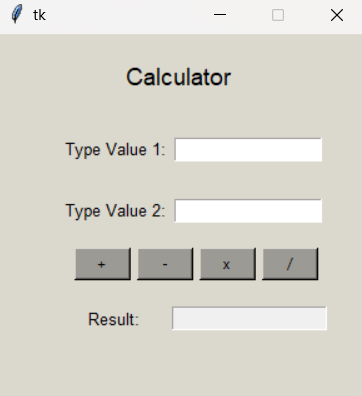

# Python-GUI-Calculator
This is a simple calculator application built using Python's Tkinter library. The application provides a graphical user interface (GUI) for basic arithmetic operations such as addition, subtraction, multiplication, and division.

### Features
- Perform basic arithmetic operations.
- Error handling for invalid input and division by zero.
- User-friendly GUI.

### Usage
- Type the first value in the "Type Value 1:" field.
- Type the second value in the "Type Value 2:" field.
- Click the desired operation button (+, -, x, /).
- The result will be displayed in the "Result:" field.

### Error Handling
If the input is not a number, the application will display an "Invalid Input" error message.

If the user tries to divide by zero, the application will display a "Syntax Error" message.

